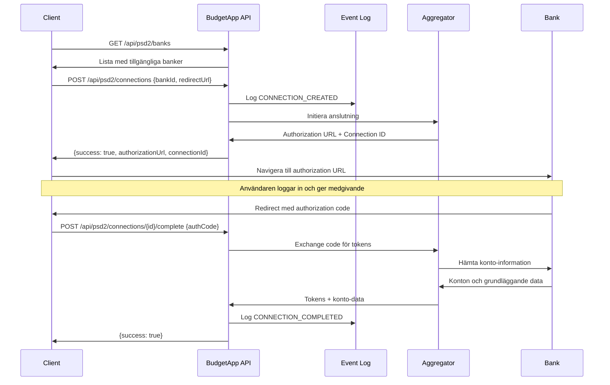
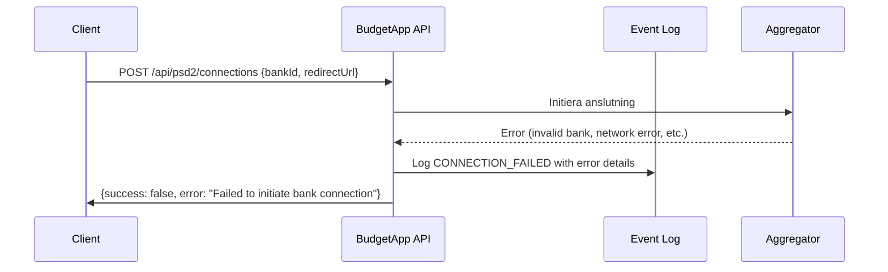
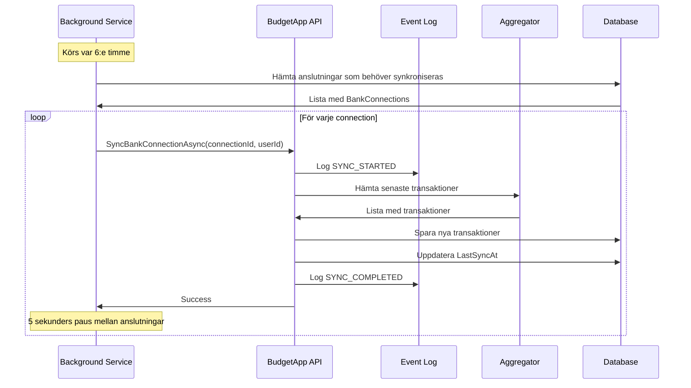
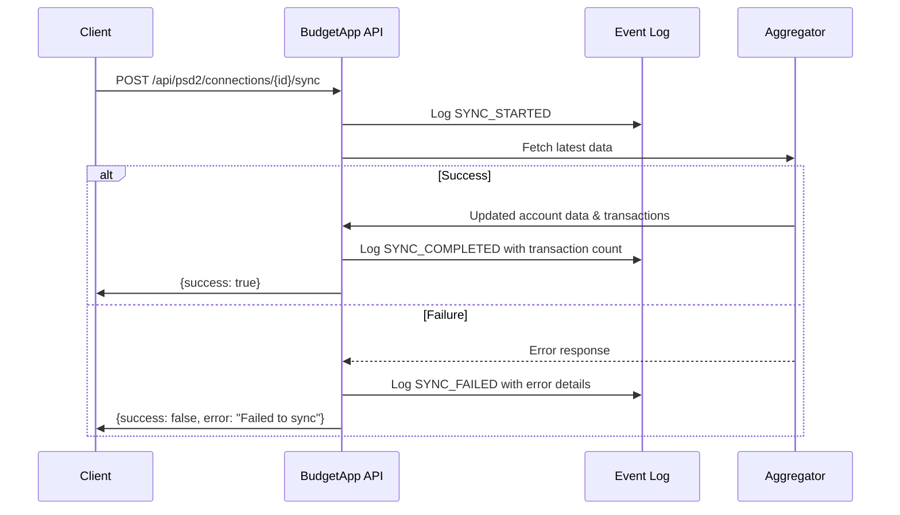
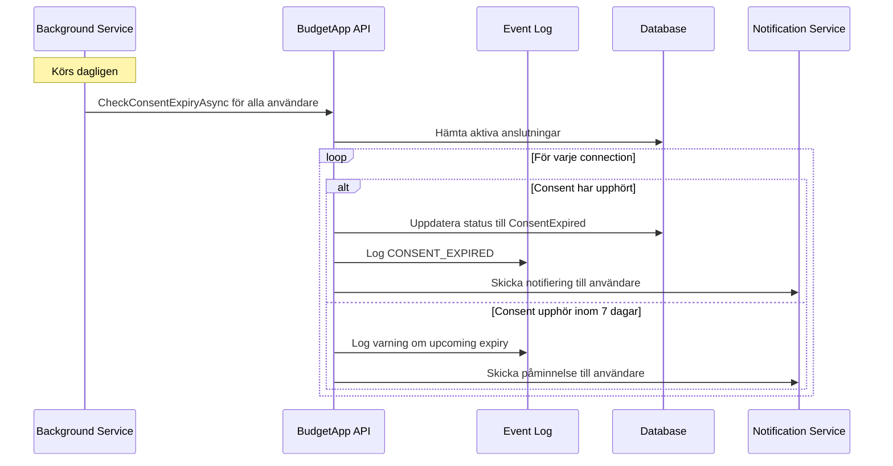
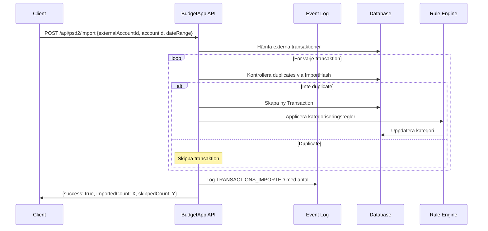

# PSD2/Open Banking Integrationsflöden och Felhantering

## 1. Översikt

Detta dokument beskriver de tekniska integrationsflöden som används för PSD2/Open Banking i BudgetForHouseholds samt detaljerad felhantering för varje scenario.

## 2. Arkitektur

```
┌─────────────┐    ┌──────────────┐    ┌──────────────┐    ┌──────────────┐
│   Client    │    │ BudgetApp    │    │  Aggregator  │    │     Bank     │
│ (Web/Mobile)│    │     API      │    │   (Tink/     │    │   (SWEDSESS  │
│             │    │              │    │  Nordigen)   │    │   etc.)      │
└─────────────┘    └──────────────┘    └──────────────┘    └──────────────┘
```

## 3. Huvudflöden

### 3.1 Bank Connection Flow (Bankanslutningsflöde)

#### 3.1.1 Lyckad anslutning


#### 3.1.2 Felhantering i anslutningsflöde


### 3.2 Synchronization Flow (Synkroniseringsflöde)

#### 3.2.1 Automatisk synkronisering


#### 3.2.2 Manuell synkronisering


### 3.3 Consent Management Flow (Medgivandehantering)

#### 3.3.1 Consent Expiry Check


### 3.4 Transaction Import Flow (Transaktionsimport)

#### 3.4.1 Lyckad import


## 4. Felhanteringsstrategier

### 4.1 Retry Policies

#### 4.1.1 Exponential Backoff
```csharp
public class RetryPolicy
{
    private static readonly TimeSpan[] RetryDelays = {
        TimeSpan.FromSeconds(1),
        TimeSpan.FromSeconds(2),
        TimeSpan.FromSeconds(4),
        TimeSpan.FromSeconds(8)
    };

    public async Task<T> ExecuteWithRetryAsync<T>(
        Func<Task<T>> operation,
        Func<Exception, bool> shouldRetry = null)
    {
        for (int attempt = 0; attempt < RetryDelays.Length; attempt++)
        {
            try
            {
                return await operation();
            }
            catch (Exception ex) when (shouldRetry?.Invoke(ex) != false)
            {
                if (attempt == RetryDelays.Length - 1)
                    throw;

                await Task.Delay(RetryDelays[attempt]);
            }
        }
    }
}
```

#### 4.1.2 Categorized Error Handling
```csharp
public enum Psd2ErrorCategory
{
    NetworkError,           // Retry med exponential backoff
    AuthenticationError,    // Logga ut användare, kräv ny inloggning
    AuthorizationError,     // Visa consent renewal UI
    ConsentExpired,        // Markera connection som expired
    BankError,             // Retry efter längre delay
    AggregatorError,       // Retry med backoff
    ValidationError,       // Ingen retry, logga för utveckling
    SystemError            // Retry en gång, sedan fail
}

public bool ShouldRetry(Psd2ErrorCategory category, int attemptNumber)
{
    return category switch
    {
        Psd2ErrorCategory.NetworkError => attemptNumber < 3,
        Psd2ErrorCategory.BankError => attemptNumber < 2,
        Psd2ErrorCategory.AggregatorError => attemptNumber < 3,
        Psd2ErrorCategory.SystemError => attemptNumber < 1,
        _ => false
    };
}
```

### 4.2 Timeout Handling

#### 4.2.1 Operation Timeouts
```csharp
public class Psd2TimeoutSettings
{
    public TimeSpan ApiCallTimeout { get; set; } = TimeSpan.FromSeconds(30);
    public TimeSpan AuthFlowTimeout { get; set; } = TimeSpan.FromMinutes(5);
    public TimeSpan SyncTimeout { get; set; } = TimeSpan.FromMinutes(2);
    public TimeSpan BulkImportTimeout { get; set; } = TimeSpan.FromMinutes(10);
}
```

#### 4.2.2 Timeout Implementation
```csharp
public async Task<T> ExecuteWithTimeoutAsync<T>(
    Func<CancellationToken, Task<T>> operation,
    TimeSpan timeout)
{
    using var cts = new CancellationTokenSource(timeout);
    try
    {
        return await operation(cts.Token);
    }
    catch (OperationCanceledException) when (cts.Token.IsCancellationRequested)
    {
        throw new TimeoutException($"Operation timed out after {timeout}");
    }
}
```

### 4.3 Rate Limiting

#### 4.3.1 Client-side Rate Limiting
```csharp
public class RateLimitedHttpClient
{
    private readonly SemaphoreSlim _semaphore;
    private readonly Queue<DateTime> _requestTimes;
    private readonly int _maxRequestsPerMinute;

    public RateLimitedHttpClient(int maxRequestsPerMinute = 60)
    {
        _maxRequestsPerMinute = maxRequestsPerMinute;
        _semaphore = new SemaphoreSlim(1, 1);
        _requestTimes = new Queue<DateTime>();
    }

    public async Task<HttpResponseMessage> SendAsync(HttpRequestMessage request)
    {
        await _semaphore.WaitAsync();
        try
        {
            await EnforceRateLimit();
            return await _httpClient.SendAsync(request);
        }
        finally
        {
            _semaphore.Release();
        }
    }

    private async Task EnforceRateLimit()
    {
        var now = DateTime.UtcNow;
        var cutoff = now.AddMinutes(-1);

        while (_requestTimes.Count > 0 && _requestTimes.Peek() < cutoff)
        {
            _requestTimes.Dequeue();
        }

        if (_requestTimes.Count >= _maxRequestsPerMinute)
        {
            var delay = _requestTimes.Peek().AddMinutes(1) - now;
            if (delay > TimeSpan.Zero)
            {
                await Task.Delay(delay);
            }
        }

        _requestTimes.Enqueue(now);
    }
}
```

## 5. Monitoring och Alerting

### 5.1 Health Checks
```csharp
public class Psd2HealthCheck : IHealthCheck
{
    private readonly IPsd2Service _psd2Service;
    private readonly BudgetAppDbContext _context;

    public async Task<HealthCheckResult> CheckHealthAsync(
        HealthCheckContext context,
        CancellationToken cancellationToken = default)
    {
        try
        {
            // Kontrollera databasanslutning
            await _context.BankConnections.CountAsync(cancellationToken);

            // Kontrollera aggregator connectivity (mock call)
            var banks = await GetAvailableBanksAsync();

            // Kontrollera background service status
            var recentSync = await _context.BankConnections
                .Where(bc => bc.LastSyncAt > DateTime.UtcNow.AddHours(-12))
                .AnyAsync(cancellationToken);

            var data = new Dictionary<string, object>
            {
                { "available_banks", banks.Count },
                { "recent_sync_activity", recentSync }
            };

            return HealthCheckResult.Healthy("PSD2 services are operational", data);
        }
        catch (Exception ex)
        {
            return HealthCheckResult.Unhealthy("PSD2 services are not operational", ex);
        }
    }
}
```

### 5.2 Metrics Collection
```csharp
public class Psd2Metrics
{
    private readonly IMetricsCollector _metrics;

    public void RecordSyncDuration(TimeSpan duration, bool success, string bankId)
    {
        _metrics.Histogram("psd2_sync_duration_seconds")
            .WithTag("success", success.ToString())
            .WithTag("bank_id", bankId)
            .Record(duration.TotalSeconds);
    }

    public void RecordApiCall(string operation, TimeSpan duration, bool success)
    {
        _metrics.Counter("psd2_api_calls_total")
            .WithTag("operation", operation)
            .WithTag("success", success.ToString())
            .Increment();

        _metrics.Histogram("psd2_api_duration_seconds")
            .WithTag("operation", operation)
            .Record(duration.TotalSeconds);
    }

    public void RecordConsentExpiry(string bankId)
    {
        _metrics.Counter("psd2_consent_expired_total")
            .WithTag("bank_id", bankId)
            .Increment();
    }
}
```

## 6. Säkerhetsaspekter

### 6.1 Token Management
```csharp
public class SecureTokenStorage
{
    private readonly IDataProtector _protector;

    public SecureTokenStorage(IDataProtectionProvider provider)
    {
        _protector = provider.CreateProtector("Psd2Tokens");
    }

    public string EncryptToken(string token)
    {
        return _protector.Protect(token);
    }

    public string DecryptToken(string encryptedToken)
    {
        return _protector.Unprotect(encryptedToken);
    }
}
```

### 6.2 Request Signing
```csharp
public class RequestSigner
{
    public void SignRequest(HttpRequestMessage request, string clientSecret)
    {
        var timestamp = DateTimeOffset.UtcNow.ToUnixTimeSeconds().ToString();
        var nonce = Guid.NewGuid().ToString("N");
        
        var signatureBase = $"{request.Method}:{request.RequestUri}:{timestamp}:{nonce}";
        
        using var hmac = new HMACSHA256(Encoding.UTF8.GetBytes(clientSecret));
        var signature = Convert.ToBase64String(
            hmac.ComputeHash(Encoding.UTF8.GetBytes(signatureBase)));

        request.Headers.Add("X-Timestamp", timestamp);
        request.Headers.Add("X-Nonce", nonce);
        request.Headers.Add("X-Signature", signature);
    }
}
```

## 7. Testning

### 7.1 Integration Test Example
```csharp
[Test]
public async Task SyncBankConnection_WithValidConnection_ShouldUpdateTransactions()
{
    // Arrange
    var userId = "test-user-id";
    var connection = await CreateTestBankConnection(userId);
    var mockTransactions = CreateMockTransactions(5);
    
    _aggregatorService.Setup(x => x.GetTransactionsAsync(It.IsAny<string>()))
        .ReturnsAsync(mockTransactions);

    // Act
    var result = await _psd2Service.SyncBankConnectionAsync(connection.Id, userId);

    // Assert
    Assert.IsTrue(result);
    
    var savedTransactions = await _context.ExternalTransactions
        .Where(t => t.ExternalAccount.BankConnectionId == connection.Id)
        .ToListAsync();
    
    Assert.AreEqual(5, savedTransactions.Count);
    
    var eventLogs = await _context.Psd2EventLogs
        .Where(e => e.EventType == Psd2EventTypes.SyncCompleted)
        .ToListAsync();
    
    Assert.AreEqual(1, eventLogs.Count);
}
```

### 7.2 Error Simulation Test
```csharp
[Test]
public async Task SyncBankConnection_WithNetworkError_ShouldRetryAndLog()
{
    // Arrange
    var connection = await CreateTestBankConnection("test-user");
    
    _aggregatorService.SetupSequence(x => x.GetTransactionsAsync(It.IsAny<string>()))
        .ThrowsAsync(new HttpRequestException("Network error"))
        .ThrowsAsync(new HttpRequestException("Network error"))
        .ReturnsAsync(new List<ExternalTransactionDto>());

    // Act
    var result = await _psd2Service.SyncBankConnectionAsync(connection.Id, "test-user");

    // Assert
    Assert.IsTrue(result); // Should succeed after retries
    
    _aggregatorService.Verify(x => x.GetTransactionsAsync(It.IsAny<string>()), 
        Times.Exactly(3)); // Verify retry logic
}
```

## 8. Deployment Considerations

### 8.1 Configuration Management
```json
{
  "Psd2": {
    "Aggregator": {
      "BaseUrl": "#{AGGREGATOR_BASE_URL}#",
      "ClientId": "#{AGGREGATOR_CLIENT_ID}#",
      "ClientSecret": "#{AGGREGATOR_CLIENT_SECRET}#",
      "Timeout": "00:00:30",
      "MaxRetries": 3
    },
    "Sync": {
      "IntervalHours": 6,
      "ConsentCheckHours": 24,
      "BatchSize": 100
    },
    "Security": {
      "EncryptTokens": true,
      "RequireHttps": true,
      "RateLimitPerMinute": 60
    }
  }
}
```

### 8.2 Database Migration
```sql
-- Lägg till event logging
CREATE TABLE Psd2EventLogs (
    Id INTEGER PRIMARY KEY AUTOINCREMENT,
    UserId TEXT NOT NULL,
    BankConnectionId INTEGER,
    EventType TEXT NOT NULL,
    EventDescription TEXT NOT NULL,
    EventData TEXT,
    Timestamp DATETIME NOT NULL,
    IsSuccess BOOLEAN NOT NULL DEFAULT 1,
    ErrorMessage TEXT,
    IpAddress TEXT,
    UserAgent TEXT,
    
    FOREIGN KEY (UserId) REFERENCES AspNetUsers(Id) ON DELETE CASCADE,
    FOREIGN KEY (BankConnectionId) REFERENCES BankConnections(Id) ON DELETE SET NULL
);

CREATE INDEX IX_Psd2EventLogs_Timestamp ON Psd2EventLogs(Timestamp);
CREATE INDEX IX_Psd2EventLogs_EventType ON Psd2EventLogs(EventType);
CREATE INDEX IX_Psd2EventLogs_UserId ON Psd2EventLogs(UserId);
```

---

*Dokumentversion: 1.0*  
*Senast uppdaterad: 2024-01-15*  
*Författare: System Architect*